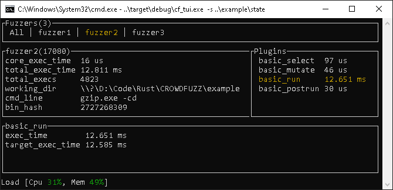

# CROWDFUZZ
A plugin based fuzzer core



(Terminal based frontend cf_tui)


## Why Another Fuzzer
This fuzzer does not bring any novel techniques to fuzzing on its own. The goal is to create a flexible and performant fuzzer __core__ that implements common functionalities that every fuzzer out there implements (folder management, UI, statistics, automation/deployement...) and allow researchers and developers to focus their efforts on fuzzing related work (file mutation, testcase generation, faster process spawning...).

## Specific Goals

* The core should be cross platform
  * Windows & Linux to start
* Have basic fuzzer features out of the box
  * Have a central UI where you see all your fuzzers at once
  * Support launching multiple instances of itself (v.s. having to launch them manually)
  * Create a consistent folder layout for fuzz projects
  * Provide a base set of stats that all projects would need (target speed, plugin speed, total execs, cpu usage, etc...)
    * Allow plugins to add custom stats
* Simple plugin development. Porting an existing fuzzer to CROWDFUZZ should be as painless as possible 
* Provide a way for plugins to communicate
  * Private data store
  * Key based public store

## Frontends
|Name | Status | Description |
|-----|--------|-------------|
|cf_tui| Done | Basic terminal based UI to monitor fuzzers on a local machine|
| ? | TODO | Web based fuzzer stat aggregator to see multiple fuzzers from multiple servers fuzzing the same project |

## List of Plugins

|Name | Status | Description |
|-----|--------|-------------|
|basic| Done |Very basic set of plugins. Should be used as reference/examples. See : [basic_select](plugins/basic_select/), [basic_mutate](plugins/basic_mutate/), [basic_run](plugins/basic_run/), [basic_postrun](plugins/basic_postrun/) |
|afl-fuzz| TODO | Standalone plugin suite that re-implements [afl-fuzz](http://lcamtuf.coredump.cx/afl/)|
|winafl| Working PoC | Implement the execution technique from [winAFL](https://github.com/ivanfratric/winafl). Re-use `afl-fuzz` plugins for the rest|
|angora| TODO | Standalone plugin suite that re-implements [AngoraFuzz](https://github.com/AngoraFuzzer/Angora)|

## Developer Guide

To develop your own plugins, you must use `cflib` and export the proper symbols in your compiled shared library (`.dll`, `.so`) :

__Rust__
```toml
[lib]
crate-type = ["cdylib"] # Compile to native lib
[dependencies]
cflib = "0.*"
```
```Rust
cflib::register!(name, "my_better_plugin");
cflib::register!(init, my_init_function);
// etc...
```
__C/C++__
```C
// -I cflib/include/
#include <cflib.h>
//<...>
__declspec(dllexport) const char *__PluginName = "my_better_plugin";
__declspec(dllexport) PluginInitCb __PluginInitFnPtr = init;
__declspec(dllexport) PluginDoWorkCb __PluginDoWorkFnPtr = do_work;
// etc...
```