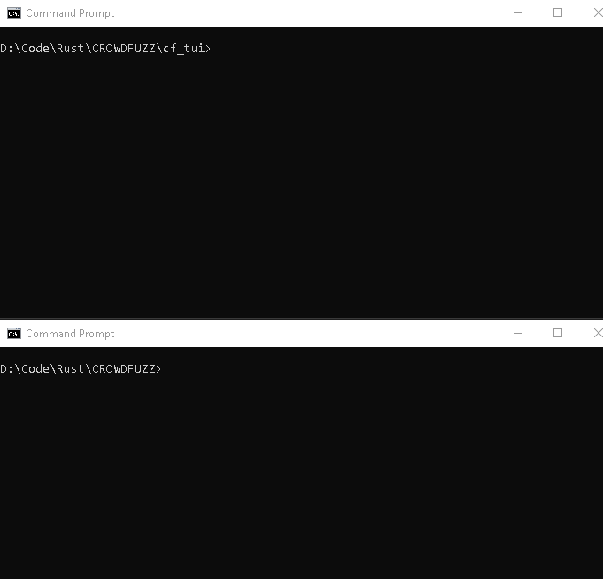

# CROWDFUZZ
A plugin based fuzzer core

(Terminal based frontend [cf_tui](cf_tui/))

## Why Another Fuzzer
This fuzzer does not bring any novel techniques to fuzzing on its own. The goal is to create a flexible and performant fuzzer __core__ that implements common functionalities that every fuzzer out there implements (folder management, UI, statistics, automation/deployement...) and allow researchers to focus their efforts on fuzzing related work (file mutation, testcase generation, faster process spawning...).

## Features
(Features provided by the core regardless of used plugins)
- Cross platform (Tested on Windows & Linux)
- Does not do __any__ (disk/terminal/network) I/O during fuzz loop
- Provide basic niceties
  - Ability to spawn itself multiple times
  - Bind to free CPUs
- Expose basic stats by default
  - Runtime information (uptime, core time, plugin time, etc...)
  - Project info (fuzz command, project folder, etc...)
- Allow stat extensions
  - Plugins can have their own arbitrary stats
- Provides a store for inter-plugin data sharing

## Frontends
|Name | Status | Description |
|-----|--------|-------------|
|[cf_tui](cf_tui/)| Done | Basic terminal based UI to monitor fuzzers on a local machine|
| web_ui | TODO | Web based ui that can receive stats from multiple remote hosts |

## List of Plugins

|Name | Status | Description |
|-----|--------|-------------|
|[fs_store](plugins/fs_store/)|✔|A local filesystem corpus manager|
|[select_input](plugins/select_input/)|✔|Selects an input based on priority or sequentially|
|[basic_mutate](plugins/basic_mutate/)|✔|Randomly changes bytes in an existing file|
|[run_target](plugins/run_target/)|✔|Runs a target with the fuzzed input|
|[save_result](plugins/save_result/)|✔|Saves crashes and timeouts|
|local_sync| TODO | Syncs local fuzzers working on the same project |
|remote_sync| TODO | Syncs remote fuzzers working on the same project |
|afl_state| Working PoC | Parses afl arguments and maintains the AFL state&queue |
|afl_mutate| Working PoC | Implement AFL's file mutators|
|afl_fork_server| TODO | Support linux forking & DynamoRio for performant process creation|
|afl_cov_analysis| TODO | Analyses the AFL bitmap to detect new coverage|

## License

 * [Apache License, Version 2.0](http://www.apache.org/licenses/LICENSE-2.0)
 * [MIT license](http://opensource.org/licenses/MIT)

## Contribution

Unless you explicitly state otherwise, any contribution intentionally submitted
for inclusion in the work by you, as defined in the Apache-2.0 license, shall be
dual licensed as above, without any additional terms or conditions.